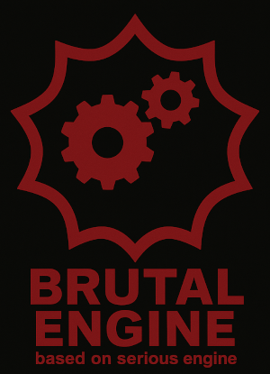

# Brutal Engine

**Brutal Engine** is a fork of the original [**Serious Engine 1**](https://github.com/Croteam-official/Serious-Engine) (released in 2001).

> **Attention!**
>
> If you need information on building the project and other nuances of the original engine, you can find it in the official repository.

One of the most notable features of Serious Engine 1 was its **powerful yet easy-to-use level editor**, which allowed users to create maps comparable in complexity to the original game's content — and sometimes even more advanced. Because of this, the engine became especially popular among mappers and modders.

Unfortunately, Serious Engine 1 is now **technically outdated**, especially by modern rendering standards.

In the original engine, **all lighting was computed on the CPU** and passed to the GPU as pre-baked textures. The GPU played almost no role in shading or dynamic lighting, which made it difficult to implement even basic dynamic effects (such as a flashlight carried by the player).

**Brutal Engine** keeps the core of Serious Engine 1 intact but introduces a **modernized rendering pipeline**. Unlike the original engine, this fork **supports a full shader pipeline**, and even allows you to write your own shaders if the built-in ones don’t meet your needs. Lighting and shading are now handled by the GPU, enabling more realistic and modern visuals.

### Supported Techniques:

* **Specular mapping**
* **Normal mapping** (bump mapping)
* **Parallax occlusion mapping** (currently for CSG geometry only)

New texture slots for these maps have been added to the level editor.

### Roadmap & Future Plans:

* Post-processing shader effects (e.g., **bloom**, **HDR**)
* **Volumetric lighting**
* Full **shadow mapping** and **dynamic shadows**
* Performance improvements for rendering **CSG geometry**

---

**Everyone is welcome to join the effort to make Serious Engine 1 great again!**

---
